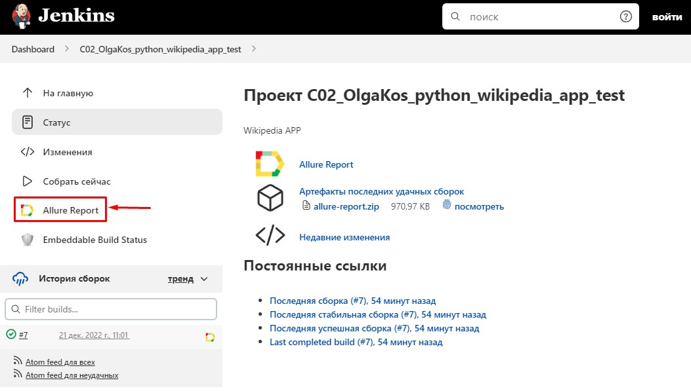
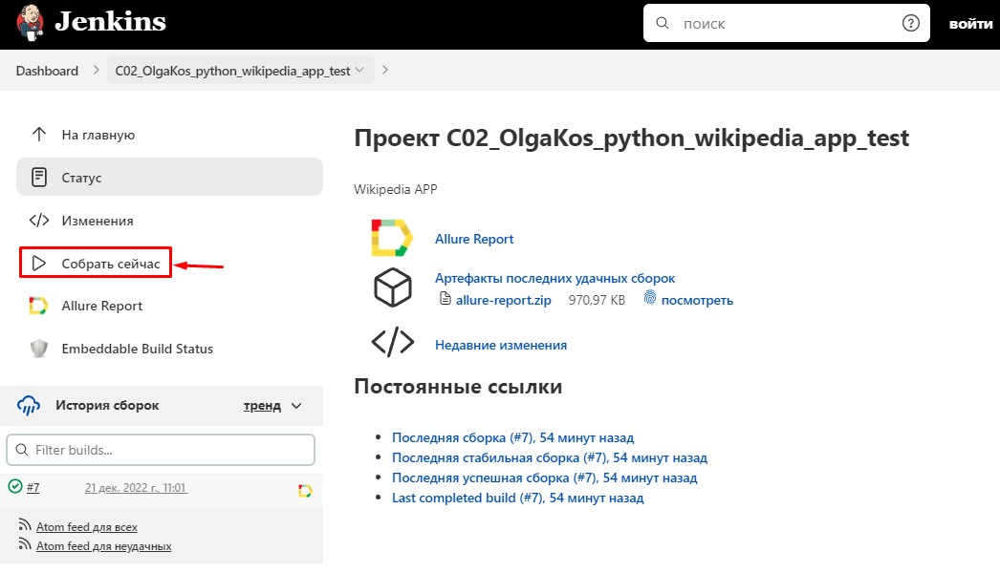
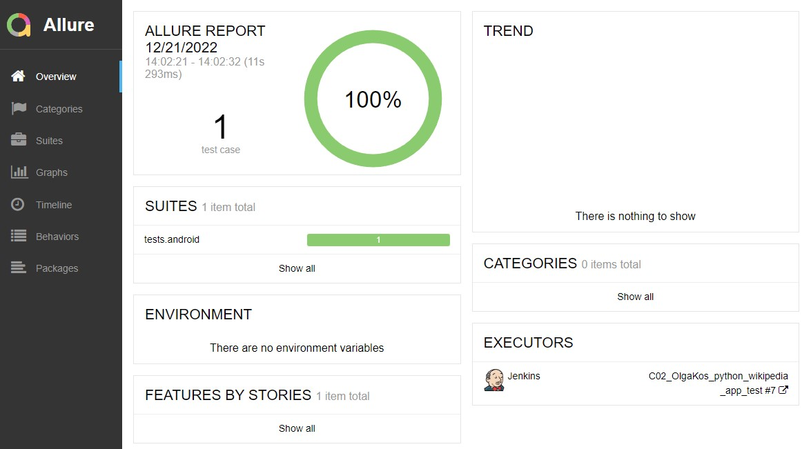
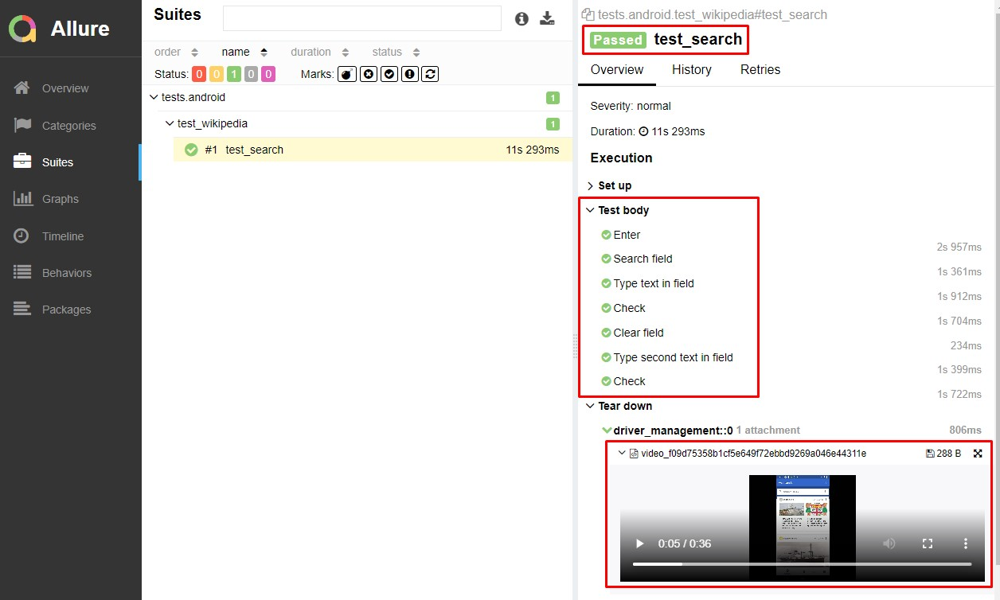

## Демо-проект по автоматизации тестирования мобильного приложения: Wikipedia APP
:earth_americas: https://ru.wikipedia.org/

К тестам прилагается бонусный функционал:

* графический визуальный отчет
* возможность запуска с любого компьютера без установки спец.софта

## :watermelon: Реализованы следующие проверки:

 :white_check_mark: Поисковый запрос Browser Strack с проверкой
 :white_check_mark: Очистка данных 
 :white_check_mark: Новый поисковый запрос Erik Bruhn с проверкой

## :four_leaf_clover: Languages and Tools:
<code></code>
<code></code>
<code></code>
<code></code>
<code></code>
<code></code>
<code></code>
<code></code>
<code></code>

## :watermelon: Jenkins. Удаленный запуск тестов (онлайн) 
Не требует установки программ на компьютер пользователя! Работает "как есть" онлайн.

Способ 1. Быстрый вариант, только просмотр:
1. <i>Не зарегистрированным</i> пользователем перейти на страницу сборки проекта по ссылке: 
<a target="_blank" href="https://jenkins.autotests.cloud/job/C02_OlgaKos_python_wikipedia_app_test/">Jenkins project</a>
2. Kликнуть на желтую иконку "Allure Report" и ознакомиться в графическим отчетом о результатах последнего запуска тестов.  

Способ 2. Запустить тесты самостоятельно: 
1. <i>Зарегистрированным/Не зарегистрированным</i> пользователем перейти на страницу сборки проекта по ссылке: 
<a target="_blank" href="https://jenkins.autotests.cloud/job/C02_OlgaKos_python_wikipedia_app_test/">Jenkins project</a>
4. Запустить выполнение тестов кнопкой "Собрать"
5. Дождаться окончания прогона (~2 минуты)
6. Кликнуть на желтую иконку "Allure Report" и получить свежий Allure Report. NB! срок хранения демо-сборки ограничен. Сборка может быть деактвирована ~через 8 недель.  

###### Главный экран Allure отчета (Owerwiev)

###### Страница с проведенными тестами (Suites)

    
<i>Легенда</i>

###  Легенда: 
###### Главная страница Allure-отчета содержит следующие информационные блоки:
- `ALLURE REPORT` отображает: Дату и время прохождения теста. Общее количество пройденных кейсов. Диаграмму с указанием процента и количества успешных, упавших и сломавшихся в процессе выполнения тестов
- `TREND` - отображает тренд прохождения тестов от сборки к сборке
- `SUITES` - отображает распределение результатов тестов по тестовым наборам
- `ENVIRONMENT` - отображает тестовое окружение (стенд), на котором запускались тесты. <i>В данном демо-примере информация не задана.</i>
- `CATEGORIES` - отображает распределение неуспешно прошедших тестов по видам дефектов
- `FEATURES BY STORIES` - отображает распределение тестов по функционалу, который они проверяют
- `EXECUTORS` - отображает исполнителя текущей сборки (ссылка на сборку в Jenkins)

## :watermelon: Видео прохождения тестов
К каждому тесту (в отчете) прилагается автоматически сгенерированное видео. Пример:

  

-------
2022-12-21
Сборка в Дженкинс: https://jenkins.autotests.cloud/job/C02_OlgaKos_python_wikipedia_app_test/
Аллюр отчет: https://jenkins.autotests.cloud/job/C02_OlgaKos_python_wikipedia_app_test/7/allure/#